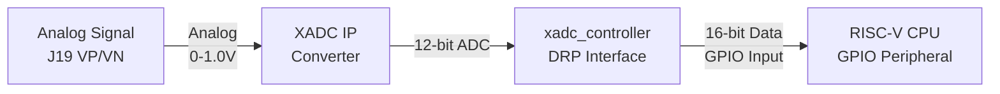
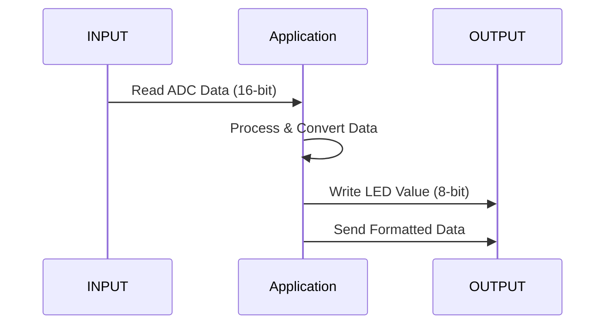
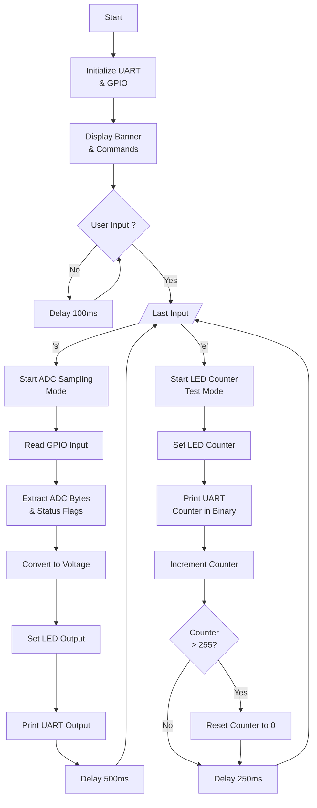

# XADC UART LEDs - Application Documentation

## Overview

`xadc_uart_leds` is a complete ADC (Analog-to-Digital Converter) testing and demonstration application for the NEORV32 RISC-V processor on the VC709 FPGA board.

The application reads analog voltage from the XADC (Xilinx Analog-to-Digital Converter) via the GPIO interface and displays the results on:
- **UART Terminal** (19200 baud) - Formatted voltage readings and status
- **LED Outputs** (8 LEDs) - Real-time binary representation of voltage

---

## Hardware Setup

### Input Signal
- **Header**: VC709 J19 (ADC connector - 20 pins)

| Net Name | J19 Pin(s) | Description |
|----------|------------|-------------|
| VN, VP | 1, 2 | Dedicated analog input channel for the XADC |
| XADC_VAUX0P, N | 3, 6 | Auxiliary analog input channel 0 |
| XADC_VAUX8N, P | 7, 8 | Auxiliary analog input channel 8 |
| DXP, DXN | 9, 12 | Access to thermal diode |
| XADC_AGND | 4, 5, 10 | Analog ground reference |
| XADC_VREF | 11 | 1.25V reference from the board |
| XADC_VCC5V0 | 13 | Filtered 5V supply from board |
| XADC_VCC_HEADER | 14 | Analog 1.8V supply for XADC |
| VADJ | 15 | VCCO supply for bank (source of DIO pins) |
| GND | 16 | Digital ground (board) reference |
| XADC_GPIO_3, 2, 1, 0 | 19, 20, 17, 18 | Digital I/O (LVCMOS18, bank 15 pins) |

**For ADC Input**: Use pins **1 (VP)** and **2 (VN)** with **Pin 5 or 10 (XADC_AGND)** as ground reference.

### Output Indicators
- **8 LEDs**: GPIO output pins (gpio_o[7:0])
  - Display 8-bit value in binary
  - Voltage mode: 0V = 0x00, 1V = 0xFF

### UART Communication
- **Baud Rate**: 19200
- **Data Bits**: 8
- **Stop Bits**: 1
- **Parity**: None

---

## Application Architecture

### Data Flow Diagram - Hardware to CPU
 

 
#### GPIO Input Bit Distribution (64-bit total)
 
The `xadc_controller` routes ADC results to the **GPIO Input** of the CPU:
 
| GPIO Bits | Source | Description |
|-----------|--------|-------------|
| [7:0] | xadc_data_vp_vn[15:8] | ADC high byte |
| [15:8] | xadc_data_vp_vn[7:0] | ADC low byte |
| [16] | xadc_busy | Busy flag (ADC converting) |
| [17] | xadc_eoc | End of Conversion flag |
| [18] | xadc_eos | End of Sequence flag |
| [19] | xadc_alarm | Alarm condition flag |
| [63:20] | GND (tied to 0) | Reserved / Unused (44 bits) |
 
**VHDL Connection** (in `neorv32_ft_uart_top.vhd`):
```vhdl
con_gpio_i(7:0)   <= xadc_data_vp_vn(15:8);   -- ADC high byte
con_gpio_i(15:8)  <= xadc_data_vp_vn(7:0);    -- ADC low byte
con_gpio_i(16)    <= xadc_busy;                -- Status flags
con_gpio_i(17)    <= xadc_eoc;
con_gpio_i(18)    <= xadc_eos;
con_gpio_i(19)    <= xadc_alarm;
con_gpio_i(63:20) <= (others => '0');          -- Unused
```


### Application Execution (One Read Cycle)
 

 
### Program Flow
 


---

## Code Structure

#### GPIO Reading
```c
static inline uint64_t gpio_input_read(void)
```
Reads the entire 64-bit GPIO input buffer (contains ADC data + status flags).

#### ADC Data Extraction
```c
static uint16_t xadc_read_raw(void)
```
- ADC data: bits [11:0] (12-bit)

#### Status Flags
```c
static int xadc_busy(void)    // Bit 16: ADC conversion in progress
static int xadc_eoc(void)     // Bit 17: End of Conversion
static int xadc_eos(void)     // Bit 18: End of Sequence
static int xadc_alarm(void)   // Bit 19: Alarm condition
```

#### Voltage Conversion
```c
static uint16_t xadc_to_voltage_mv(uint16_t raw)
```
Converts 12-bit ADC value to voltage in millivolts using integer-only arithmetic:
```c
uint16_t adc12 = raw >> 4;
return (uint16_t)(((uint32_t)adc12 * 1000) >> 12);
```
- Shift right 4 bits to extract 12-bit ADC value
- Multiply by 1000 (using 32-bit to avoid overflow)
- Shift right 12 bits (equivalent to dividing by 4096)
- Result in millivolts (0-1000 mV for 0-1.0V range)

#### LED Mapping
For LED display, voltage is mapped directly from raw ADC value:
```c
uint8_t led_value = raw_vpvn >> 8;
```
Maps 16-bit raw ADC to 8-bit LED value:
- 0x000 → LEDs = 0x00 (00000000)
- 0x800 → LEDs ≈ 0x7F (01111111)
- 0xFFF → LEDs = 0xFF (11111111)

#### Output Functions
```c
static void print_binary_8bit(uint8_t value)
static void print_hex32(uint32_t value)
static void print_voltage(uint16_t mv)
```
Custom printing functions (no unsupported format strings).

---

## Operating Modes

### Mode 1: ADC Sampling (`s` command)

**Purpose**: Display real-time ADC readings

**Operation**:
1. Continuously samples XADC every 500ms
2. Reads raw 16-bit value from GPIO
3. Converts to voltage (mV)
4. Sets LEDs to 8-bit voltage representation

**UART Output**:
```
Sample | Raw_Hex | Voltage | LED_Bits_8 | Busy EOC EOS Alarm | GPIO_Buffer
-------|---------|---------|------------|--------------------|---------------
  0    | 800     | 0.500   | 01111111   | 0 1 0 0            | 00000CD0008
```

**LED Behavior**:
- 8 LEDs show binary representation of voltage
- More LEDs lit = higher voltage

### Mode 2: LED Counter Test (`e` command)

**Purpose**: Verify all 8 LED pins are working correctly

**Operation**:
1. Increments 8-bit counter every 250ms
2. Displays counter value in binary on LEDs
3. Shows binary count in UART output
4. Resets to 0 after reaching 255

**UART Output**:
```
Counter: 0 (binary: 00000000)
Counter: 1 (binary: 00000001)
Counter: 2 (binary: 00000010)
...
Counter: 255 (binary: 11111111)
--- Counter reset to 0 ---
```

**LED Pattern**:
- Starts: 00000000 (no LEDs)
- Increments: 00000001, 00000010, 00000011, ...
- Repeats: Pattern cycles continuously


---

## Important Notes

### Voltage Resolution
- 12-bit ADC with 1.0V reference
- Resolution: 1.0V / 4096 ≈ **0.244 mV per step**
- 8-bit LED mapping: 1.0V / 256 ≈ **3.9 mV per LED**

### Sampling Rate
- ADC sampling: Every 500ms (2 Hz)
- LED counter: Every 250ms

## References

- NEORV32 GPIO Peripheral: https://stnolting.github.io/neorv32/
- VC709 J19 Connector Pinout: [Xilinx UG887](https://docs.amd.com/v/u/en-US/ug887-vc709-eval-board-v7-fpga)

Using Mermaid for generating diagrams.  
Used this site for export: <https://www.mermaideditor.io/export/svg>

